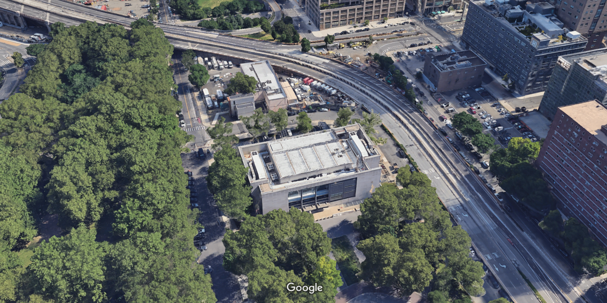
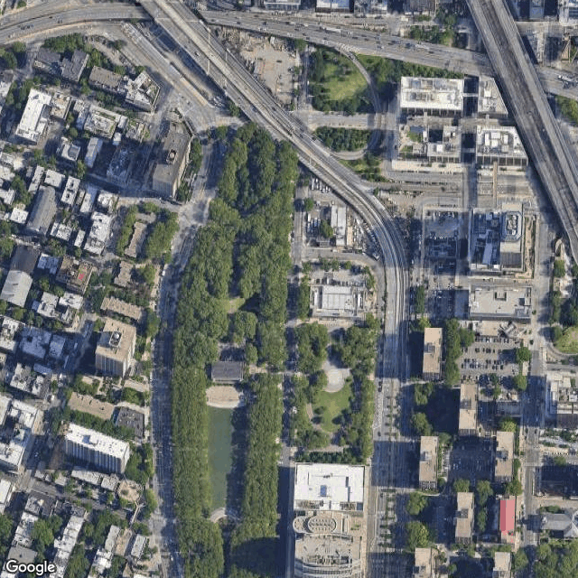
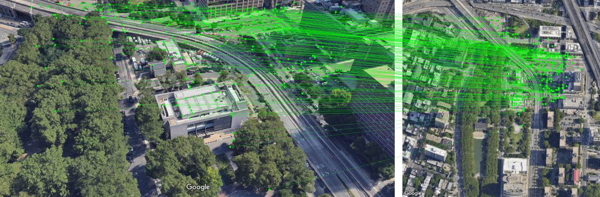
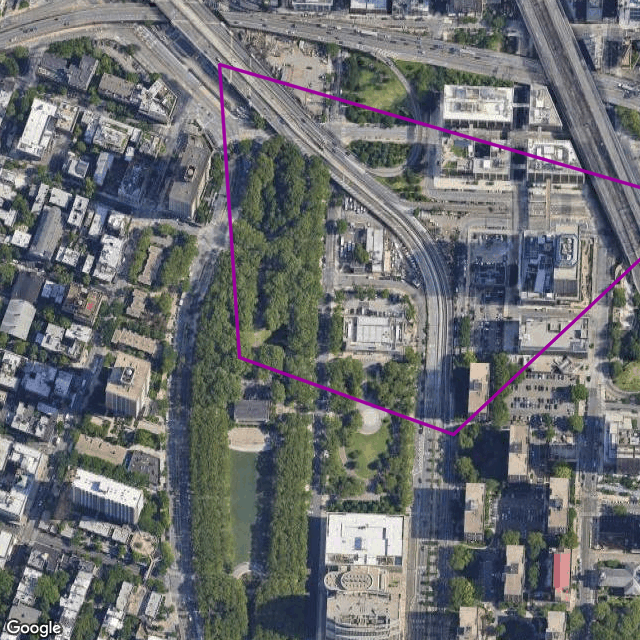
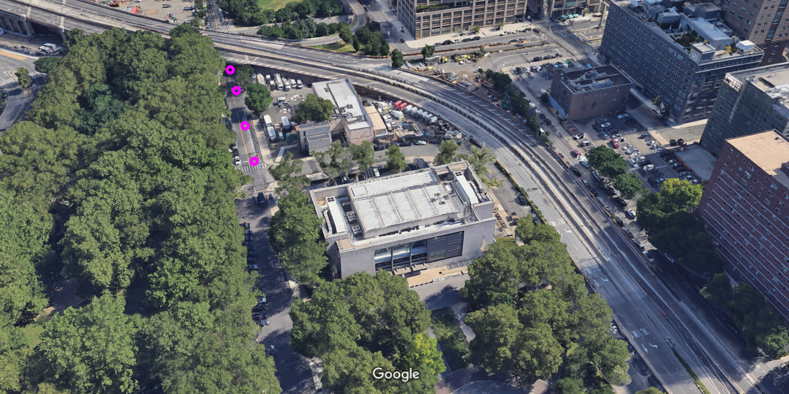
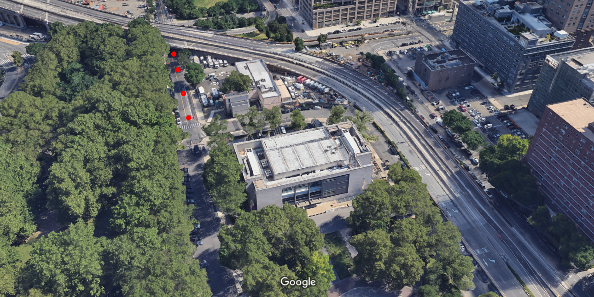

# Home Assignment

## Motivation

The primary objective of this assignment is to convert waypoints from a global reference frame (Latitude, Longitude) in degrees to:
1. Drone's body reference frame (X, Y, Z) in meters.
2. Drone's Image plane (i, j) in pixels.

We are given two images:
1. Drone's frame.
2. A satellite view of the area, together with additional geo-information:
   1. The coordinates (Lat, Lon) of the top-left pixel.
   2. Meter per pixel (mpp).

<p align="center">

</p>
<h6 align="center">Drone Image</h6>

<p align="center">

</p>
<h6 align="center">Satellite view of the area</h6>

## Tasks

### Overview
In order to do so, we are going to break the task into two main parts:

First, we will estimate the drone's position in the global reference frame (Lat, Lon):
1. We will find matching points between the drone's frame and the satellite image
2. Draw the drone's footprint (the boundaries of the drone's frame) in the satellite image
3. Estimate the drone's position

And Then, we will convert the given waypoints (lat, lon):
4. Using extrinsic matrix to project the waypoints to drone's body frame (X, Y, Z).
5. Using the projection matrix to project the waypoints to drone's image plane (i, j). 
6. Using homography transformation between the two views (drone and satellite) to project the waypoints to drone's image plane (i, j).

You are given two scripts: 
1. ```python nav.py``` - It includes a `DronePosition` class. 
This class has 6 methods that you need to fill according to the above 1-6 steps.
2. ```python utils.py``` - A utils script that contains some geolocation helper functions.

### Guidelines

1. Write the `find_matches` method that finds matches between the two views. 
   1. Please use LightGlue to do so: https://github.com/cvg/LightGlue.
   2. Plot the matches and attach the image. The result should look something similar to:

<p align="center">

</p>
<h6 align="center">Matches</h6>

2. Write the `find_footprint` method. 
   1. You can use cv2.findHomography() method.
   2. This method should plot the drone's footprint on the satellite image:

<p align="center">

</p>
<h6 align="center">Footprint</h6>

3. Write the `estimate_drone_position` method. In order to estimate the drone's position use the PNP algorithm (https://en.wikipedia.org/wiki/Perspective-n-Point). 
You can use cv2.solvePnPRansac() method.
Notes:
   1. You need to convert the satellite points to meters, use the `self.mpp` attribute for meter per pixel information. 
   2. Add a Z dimension. Assume Z=0 for all points in the satellite.
   3. Use the camera matrix already given in `self.camera_mat` attribute.
   4. The tvec output of the cv2.solvePnPRansac() method must be rotated to world's reference frame as follows
   `tvec_w = np.dot(-cv2.Rodrigues(rvec)[0].T, tvec)`.
   5. Draw the position of the drone:

<p align="center">

</p>
<h6 align="center">Drone's position</h6>

4. Write the `project_waypoints` method.
   1. There are 4 waypoints in the `self.waypoints` attribute in a (lat, lon) format.
   2. Use the `delta_latlon_to_meters` method in the ```python utils.py``` to convert the waypoints to meters in the satellite image.
   Use the `self.sat_top_left` attribute for the coordinates of the top-left pixel in the satellite image.
   3. You need to build the extrinsic matrix. Use tvec and rvec from the previous step.
   4. Using the extrinsic matrix, project the waypoints into the drone's body frame.


5. Write the `draw_waypoints_extrinsic` method.
   1. Use the waypoints from the previous step and `self.camera_mat` to project the waypoints to the drone's image plane
   2. Draw the waypoints, it should like something like:

<p align="center">

</p>
<h6 align="center">Projected waypoints extrinsic</h6>

6. Write the `draw_waypoints_homography` method, that draw the waypoints assuming homography transformation between the views.
   1. Use the `latlon_to_pixels` method in the ```python utils.py``` to convert the waypoints to pixels in the satellite image.
   2. Use the homography matrix you found in step (2) to project the waypoints to the drone's image plane.

<p align="center">

</p>
<h6 align="center">Projected waypoints homography</h6>


### General Notes

1. Don't spend too much time if you don't get precise results. 
There are some assumptions in this assignment (Pinhole camera model, Flat world etc.) which are not 100% correct.

2. The final solution should include:
   1. A complete `DronePosition` class in `nav.py`. Feel free to change it as you like.
   2. The following images:
      1. Matches
      2. Drone's footprint
      3. Drone's position
      4. Projected waypoints using extrinsic matrix
      5. Projected waypoints using homography
   3. Projected waypoints in the drone's body frame (X, Y, Z) in meters.